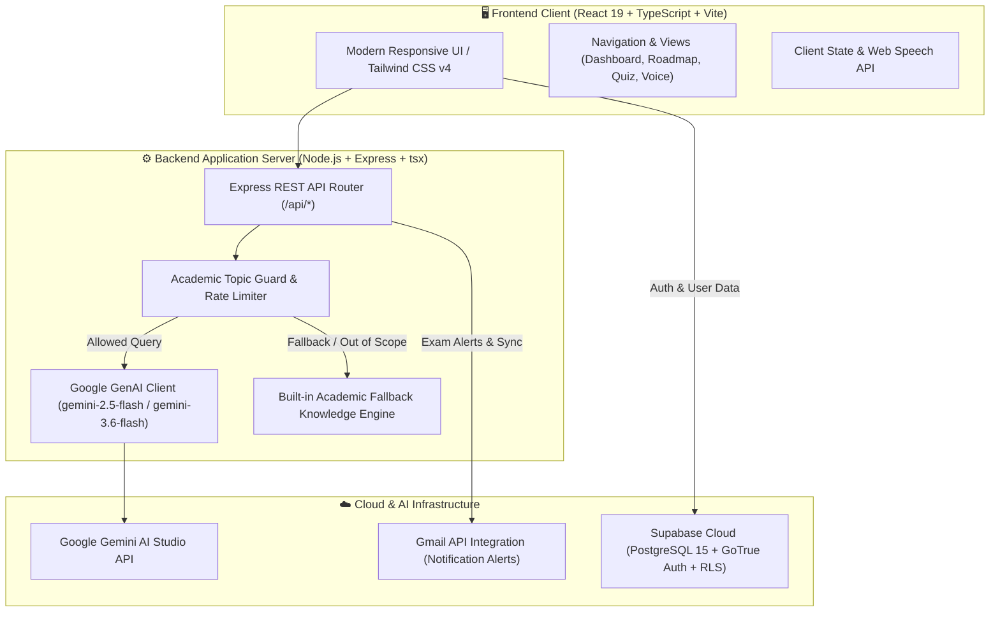
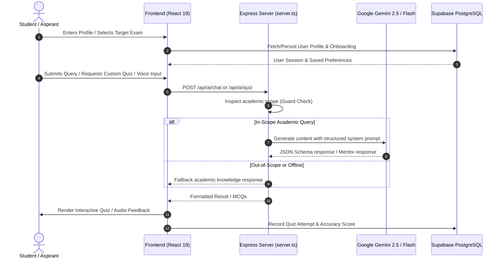

# 🎓 Competitive World — AI-Powered Exam & Career Companion

<div align="center">


**An intelligent, multi-modal career navigation and competitive examination preparation ecosystem tailored for Indian students and aspirants.**

[Explore Features](#-key-features) • [System Architecture](#-system-architecture) • [Getting Started](#-getting-started) • [API Reference](#-api-endpoints) • [Database Schema](#-database-schema)

</div>

---

## 🌟 Executive Summary

**Competitive World** bridges the guidance gap faced by millions of Indian aspirants preparing for state and national competitive examinations (such as **APPSC Groups I–IV, UPSC Civil Services, GATE, SSC CGL/CHSL, RRB Railways, Banking/IBPS, and Defence**).

By unifying **Google Gemini Generative AI**, **Supabase PostgreSQL with Row-Level Security**, and an intuitive **React 19 & Tailwind CSS v4** interface, the platform offers personalized roadmaps, bilingual AI mentoring (English & Telugu/Teluglish), dynamic mock tests, and actionable performance analytics.

---

## 🏛️ System Architecture

### High-Level Architecture Overview



---

### Data & AI Orchestration Flow



---

## ✨ Key Features

| Feature | Description | Technology |
| :--- | :--- | :--- |
| 🎯 **AI Career Finder** | Recommends top matching exams based on education, branch, state, daily study bandwidth, and strengths. | Gemini Generative AI + Heuristic Engine |
| 🤖 **Bilingual Contextual AI Mentor** | Context-aware academic tutor supporting English and Telugu/Teluglish with strict anti-hallucination academic boundaries. | `@google/genai` (Flash model) |
| 🎙️ **AI Voice Mentor** | Voice-in, voice-out hands-free interactive mentoring using native Speech Recognition and Speech Synthesis. | Web Speech API + Gemini AI |
| 📝 **Adaptive Quiz & Mock Generator** | Generates authentic syllabus-aligned MCQs, timer-based tests, immediate answer explanations, and scoring. | Node.js + Express API + Gemini |
| 🗺️ **Personalized Dynamic Roadmap** | Milestone-driven phase-by-phase prep journey from foundation to revisions and mock marathons. | React + Lucide Icons |
| ⚖️ **Exam Comparison Engine** | Side-by-side metric comparison of syllabus, stages, salary grade, difficulty, and age limits across 20+ exams. | TypeScript State Engine |
| 📊 **Performance Analytics** | Accuracy tracking, question time analysis, weak topic diagnosis, and bookmarking. | Supabase PostgreSQL + JSONB |
| 🔔 **Notification Center & Gmail Alerts** | Tracks notifications, admit card releases, and deadlines with instant toast updates and email alerts. | Gmail Service + Event Triggers |
| 🔐 **Authentication & Security** | Secure email/password login, automatic profile provisioning, and PostgreSQL Row-Level Security (RLS). | Supabase Auth + Postgres RLS |

---

## 💻 Tech Stack

### Frontend
- **Framework**: [React 19](https://react.dev/) + [TypeScript](https://www.typescriptlang.org/)
- **Build Tool**: [Vite 6](https://vitejs.dev/)
- **Styling**: [Tailwind CSS v4](https://tailwindcss.com/) with `@tailwindcss/vite`
- **Icons & Motion**: [Lucide React](https://lucide.dev/) + [Motion](https://motion.dev/)

### Backend & AI Engine
- **Server**: [Express 4](https://expressjs.com/) on Node.js
- **Execution**: [tsx](https://github.com/privatenumber/tsx) (TypeScript execute)
- **Bundler**: [esbuild](https://esbuild.github.io/) for production server compilation
- **AI Models**: Google Gemini 2.5 Flash via `@google/genai` SDK
- **Bilingual Fallback**: Dedicated local academic knowledge engine

### Database & Cloud
- **Database**: [Supabase](https://supabase.com/) PostgreSQL with RLS policies
- **Authentication**: Supabase Auth (JWT & session management)
- **Deployment Ready**: [Netlify](https://www.netlify.com/) (configured via `netlify.toml`) & Cloud Run

---

## 📁 Repository Structure

```text
.
├── .env.example              # Environment variables template
├── .gitignore                # Git ignore rules for node_modules, build, .env
├── index.html                # Single-page application root HTML
├── metadata.json             # Applet metadata and permissions
├── netlify.toml              # Netlify build and SPA routing configuration
├── package.json              # Project dependencies and npm scripts
├── server.ts                 # Express API server + Vite middleware
├── tsconfig.json             # TypeScript compiler configuration
├── vite.config.ts            # Vite build configuration with Tailwind v4
├── supabase/
│   └── schema.sql            # Full SQL schema, RLS policies, and triggers
└── src/
    ├── App.tsx               # Root application component & view router
    ├── index.css             # Tailwind v4 theme & global styling
    ├── main.tsx              # React DOM entry point
    ├── supabase.ts           # Supabase client initialization & helper methods
    ├── types.ts              # Global TypeScript interfaces & types
    ├── components/           # Reusable UI components
    │   ├── AIChatbotView.tsx           # Contextual AI Chatbot interface
    │   ├── AIVoiceAgentModal.tsx       # Voice agent modal dialog
    │   ├── AdminPanelView.tsx          # Exam content & notification manager
    │   ├── AuthModal.tsx               # Sign in / Sign up modal dialog
    │   ├── CareerComparisonView.tsx    # Multi-exam comparator
    │   ├── CareerFinderView.tsx        # Profile-driven exam recommender
    │   ├── DashboardView.tsx           # Central user dashboard
    │   ├── EligibilityCheckerModal.tsx # Instant eligibility calculator
    │   ├── ExamDetailView.tsx          # Comprehensive exam details & syllabus
    │   ├── ExamsExplorerView.tsx       # Searchable catalog of Indian exams
    │   ├── GmailIntegrationView.tsx    # Email alert integration
    │   ├── LandingPage.tsx             # Public landing page
    │   ├── Navbar.tsx                  # Top navigation bar
    │   ├── NotificationsView.tsx       # Live notification board
    │   ├── OnboardingModal.tsx         # New user questionnaire
    │   ├── PerformanceView.tsx         # Score tracking & history
    │   ├── ProfileSettingsModal.tsx    # User settings & preferences
    │   ├── QuizGeneratorView.tsx       # AI mock examination simulator
    │   ├── RoadmapView.tsx             # Personalized milestone roadmap
    │   ├── Sidebar.tsx                 # Navigation drawer
    │   ├── StudyPlannerView.tsx        # Daily study schedule creator
    │   └── ToastNotification.tsx       # Pop-up notification toasts
    ├── data/                 # Static knowledge bases & datasets
    │   ├── examsData.ts                # 20+ National and AP state exams data
    │   ├── quizDatabase.ts             # Standard question banks & generator
    │   └── studyKnowledgeEngine.ts     # Offline bilingual academic fallback
    └── lib/
        └── gmailService.ts             # Gmail API notification dispatcher
```

---

## 🚀 Getting Started

### Prerequisites
- **Node.js**: v18.0.0 or higher
- **npm** or **bun** / **yarn** / **pnpm**
- **Google Gemini API Key**: Obtainable from [Google AI Studio](https://aistudio.google.com/)
- **Supabase Account**: (Optional for local testing; fallback mode operates without external credentials)

### 1. Clone the Repository
```bash
git clone https://github.com/Bhagyasri-NXTWAVE/Hackathon.git
cd Hackathon
```

### 2. Install Dependencies
```bash
npm install
```

### 3. Setup Environment Variables
Create a `.env` file in the root directory:
```bash
cp .env.example .env
```
Populate the values inside `.env`:
```env
# Gemini Generative AI Key
GEMINI_API_KEY="your-gemini-api-key-here"

# Application URL
APP_URL="http://localhost:3000"

# Supabase Credentials (optional if using client-side defaults)
VITE_SUPABASE_URL="https://your-project-id.supabase.co"
VITE_SUPABASE_ANON_KEY="your-anon-key-here"
```

### 4. Run Development Server
```bash
npm run dev
```
Open your browser and navigate to:
```
http://localhost:3000
```

---

## 📡 API Endpoints

The Express server (`server.ts`) exposes the following RESTful API endpoints:

| Method | Endpoint | Description |
| :--- | :--- | :--- |
| `GET` | `/api/health` | Health-check status and verifies Gemini AI engine connectivity. |
| `GET` | `/api/exams` | Fetches complete database of national & state competitive exams. |
| `GET` | `/api/notifications` | Returns active government exam notification alerts and deadlines. |
| `POST` | `/api/ai/career-recommend` | Analyzes student academic background and recommends top matching exams. |
| `POST` | `/api/ai/chat` | Contextual AI mentor endpoint with Telugu/English support and academic guardrails. |
| `POST` | `/api/ai/quiz` | Dynamically generates custom MCQs from official exam syllabus. |
| `POST` | `/api/ai/voice-agent` | Audio/Voice prompt synthesis and mentorship responses. |
| `POST` | `/api/ai/study-plan` | Creates tailored day-by-day and week-by-week study timetables. |

---

## 🗄️ Database Schema

The database runs on **Supabase PostgreSQL** with Row-Level Security enabled for all tables. To set up the database tables:
1. Open the [Supabase SQL Editor](https://supabase.com/dashboard).
2. Execute the queries located in [`supabase/schema.sql`](supabase/schema.sql).

### Key Tables:
- **`public.profiles`**: Extends `auth.users` with personal information, target exam, and contact info.
- **`public.user_onboarding`**: Captures stream, degree, graduation year, and pathway recommendation.
- **`public.quiz_attempts`**: Stores test score, question count, accuracy percentage, time taken, and JSON responses.
- **`public.bookmarks`**: Keeps student's saved questions for focused revision.
- **`public.handle_new_user()`**: PostgreSQL trigger automatically initializing user profiles upon registration.

---

## 🚢 Production Build & Deployment

### Build the Project
```bash
npm run build
```
This executes:
1. `vite build` — Compiles the React client into the `dist/` folder.
2. `esbuild server.ts` — Bundles the production backend into `dist/server.cjs`.

### Start Production Server
```bash
npm start
```

### Deploy to Netlify
The repository includes a ready-to-use [`netlify.toml`](netlify.toml). Simply connect the GitHub repository to Netlify:
- **Build command**: `npm run build`
- **Publish directory**: `dist`
- **Redirects**: SPA fallback configured to `/index.html`

---

## 🛡️ Security & Quality Standards

- **Academic Integrity Guard**: Queries unrelated to academics or exams are gracefully filtered.
- **Credential Protection**: Strict `.gitignore` policy prevents leaking `.env`, private keys, and build artifacts.
- **Security Headers**: Standard HTTP headers (`X-Frame-Options`, `X-Content-Type-Options`, `Referrer-Policy`) enabled in production.
- **Row Level Security**: Users can only read and write their own profile and quiz records in Supabase.

---

## 👥 Authors & Acknowledgments

- **Lead Developer**: Bhagyasri ([@Bhagyasri-NXTWAVE](https://github.com/Bhagyasri-NXTWAVE))
- Built with ❤️ for competitive exam aspirants across India.

---

<div align="center">
  <sub>Competitive World © 2026. All rights reserved.</sub>
</div>
